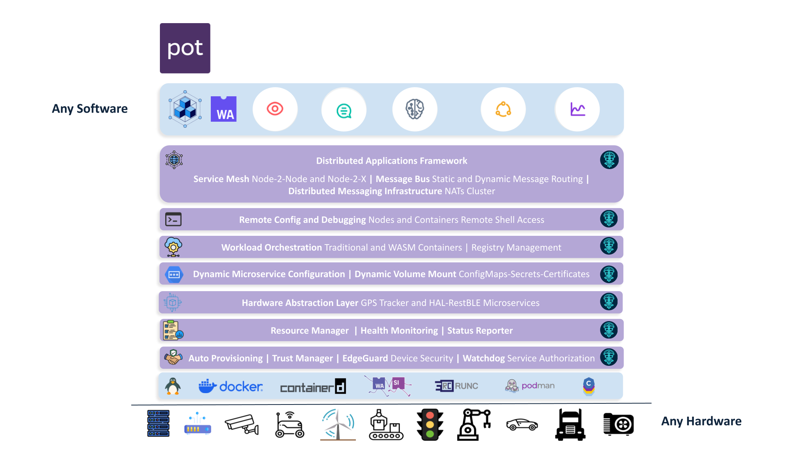
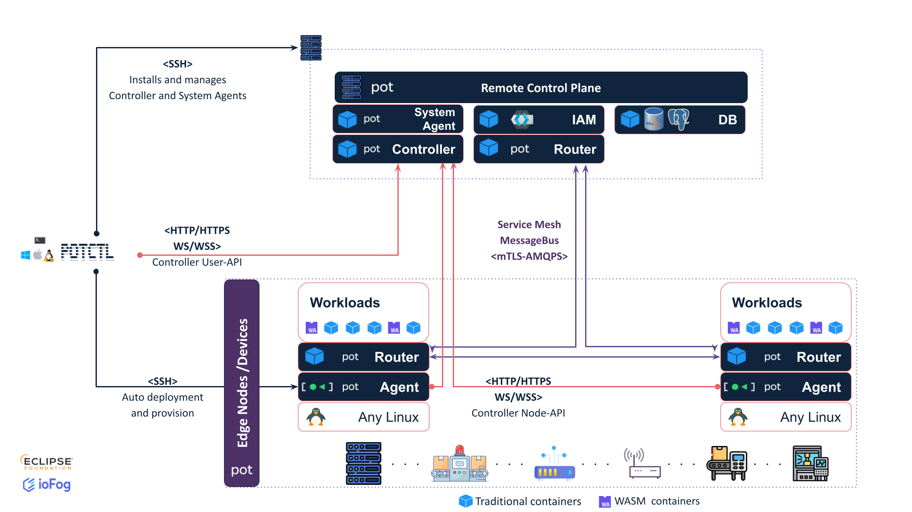
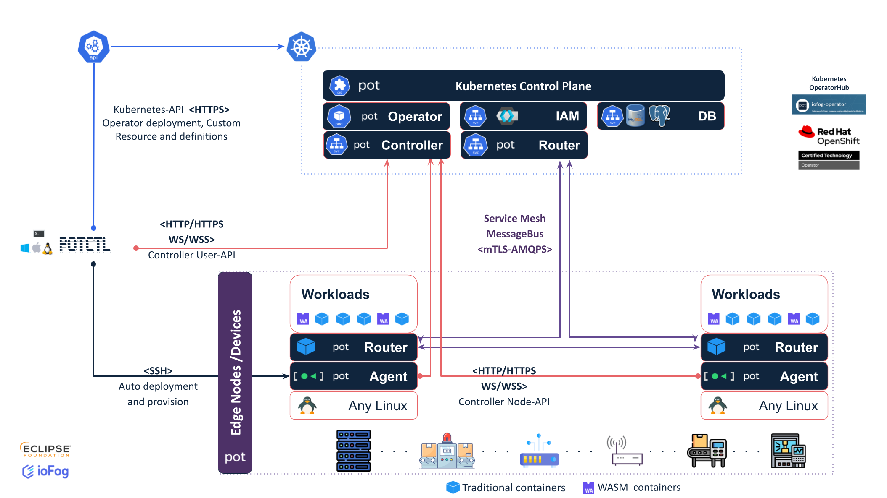

# PoT - Platform of Things

**Enterprise Open Source Distributed Edge Computing Platform**

Datasance Platform of Things (PoT) is a fully open-source, enterprise-ready distributed edge computing platform. Built upon the foundation of Eclipse ioFog v3, PoT is designed to resolve critical infrastructure challenges across the entire Cloud-Edge-IoT continuum.

PoT transcends basic orchestration by integrating core features for workload lifecycle management across diverse edge environments with essential enterprise capabilities developed by Datasance.

## About PoT

PoT transforms Eclipse ioFog from an orchestration-only tool into a comprehensive EdgeOps platform with built-in operational and security features, including:

- **Integrated Certificate Management**: Automatic generation and distribution of SSL/TLS certificates for all platform components and user workloads, eliminating complex manual security configuration.
- **Router-Based Service Mesh**: Creates a Layer 7 service mesh for secure, isolated network communication, a capability that often requires complex manual setup in competing solutions.
- **Agent Security Model & IAM Integration**: Provides a robust security model and seamless identity and access management (IAM) integration with Keycloak.

## Architecture

PoT consists of several core components that work together to form an Edge Compute Network (ECN):

### Platform Architecture

PoT provides a comprehensive layered architecture that supports distributed applications across diverse edge environments, from any software to any hardware:

### Deployment Architectures

#### Remote Control Plane Architecture

The control plane can be deployed remotely, with Controllers orchestrating distributed Agents across networks:

#### Kubernetes Control Plane Architecture

For enterprise deployments, the control plane can be deployed on Kubernetes:

## Key Features

- **Enterprise Open Source**: Built for organizations seeking reliable, vendor-neutral solutions.
- **Kubernetes Native**: Seamlessly integrates with Kubernetes for control plane management.
- **Edge Computing and Fog**: Facilitates distributed computing with both traditional and WebAssembly containers support.
- **Built-in Scalability**: High availability and scalability for enterprise-grade deployments.
- **CLI Tool (potctl)**: Simplified deployment and management through command-line operations.
- **Enhanced IAM**: Enterprise-grade identity and access management with Keycloak.
- **Vendor-Agnostic Hardware Support**: Flexible deployment across diverse edge devices.

## Core Differentiators

| Feature | PoT Advantage |
|---------|---------------|
| **Vendor Neutrality** | Lightweight, fully open-source and designed to operate on any Linux distribution, regardless of hardware brand or processor architecture. This prevents vendor lock-in and maximizes the utility of existing infrastructure investments. |
| **Consistent Deployment** | Enables consistent deployment of diverse applications (AI optimization, data pipelines, control systems) across heterogeneous edge environments. |
| **Operational Automation** | Automated cluster deployment and Edge node provisioning handles installation of dependencies and node configuration without manual intervention. REST API enables integration of CI/CD workflows and streamlines operations. |
| **Dynamic Configuration** | Provides dynamic reconfiguration API and dynamic VolumeMount from Secrets and ConfigMaps without requiring service restarts, allowing operators to adapt to real-time changes and problems. |
| **Integrated Marketplaces** | Application Templates and Catalog Image Items enable the creation of internal marketplaces for edge applications, accelerating the distribution of algorithms, models, and services at scale. |

## Security and Networking Excellence

Unlike fragmented market offerings that require manually integrating separate tools for security and service communication, PoT provides these capabilities as cohesive, first-class features:

- **Built-in Security**: Integrated mTLS (Mutual TLS) and IAM simplify security deployment.
- **Isolated Network Communication**: The unique router architecture creates a Layer 7 service mesh that ensures secure communication even between nodes operating on isolated networks.

## Components

PoT is composed of several open-source components, each maintained in its own repository:

### Core Components

- **[potctl](potctl/)** - Unified CLI tool for installation, configuration, and operation of PoT Edge Compute Networks
- **[Controller](controller/)** - The orchestration center that manages Agents, microservices, and the entire ECN
- **[Agent](agent/)** - Edge node worker daemon that runs and manages microservices on edge devices
- **[Router](router/)** - Service mesh component enabling secure microservice-to-microservice communication
- **[ECN-Viewer](ecn-viewer/)** - Browser-based control plane for managing and monitoring ECNs
- **[iofog-operator](k8s-operator/)** - Kubernetes operator for managing PoT control planes and applications

### Development Tools

- **[iofog-go-sdk](sdk/golang/)** - Go SDK for developing microservices that communicate within the PoT network

## Getting Started

### Quick Start

1. **Install potctl**: Download and install the PoT CLI tool from the [potctl repository](https://github.com/Datasance/potctl)
2. **Deploy Control Plane**: Use potctl to deploy a Controller on Kubernetes or a remote host
3. **Add Agents**: Install and connect Agents to your edge nodes
4. **Deploy Applications**: Start deploying microservices and applications to your Edge Compute Network

### Documentation

For comprehensive documentation, visit the [Datasance PoT Documentation](https://docs.datasance.com).

Key documentation sections:
- [Getting Started](https://docs.datasance.com/getting-started/introduction)
- [Architecture Overview](https://docs.datasance.com/getting-started/architecture)
- [Platform Deployment](https://docs.datasance.com/platform-deployment/introduction)
- [Agent Management](https://docs.datasance.com/agent-management/introduction)
- [Application Management](https://docs.datasance.com/applications/introduction)

## Value Proposition

The PoT platform represents a significant innovation by providing a unified platform that seamlessly integrates workload management, service mesh communication, and robust security. By eliminating the complexity and operational overhead associated with assembling multiple disparate tools, PoT:

- **Reduces Total Cost of Ownership (TCO)**
- **Accelerates time-to-value**
- **Enables organizations to focus on application development rather than infrastructure management**
- **Unlocks Edge-native service models**

## Use Cases

PoT is designed for organizations that need to deploy and manage distributed workloads at the edge, including:

- **Industrial IoT (IIoT)**: Manufacturing automation, predictive maintenance, quality control
- **Smart Infrastructure**: Smart cities, transportation systems, energy grids
- **Retail and Logistics**: Supply chain optimization, inventory management, real-time analytics
- **Healthcare**: Remote patient monitoring, medical device management, telemedicine
- **Telecommunications**: Network function virtualization, edge caching, content delivery

## Contributing

PoT is an enterprise open-source project. Each component is maintained in its own repository:

- [potctl](https://github.com/Datasance/potctl)
- [Controller](https://github.com/Datasance/Controller)
- [Agent](https://github.com/Datasance/Agent)
- [Router](https://github.com/Datasance/Router)
- [ECN-Viewer](https://github.com/Datasance/ECN-Viewer)
- [iofog-operator](https://github.com/Datasance/iofog-operator)
- [iofog-go-sdk](https://github.com/Datasance/iofog-go-sdk)

Please refer to individual component repositories for contribution guidelines and code of conduct.

## Support

We're here to help! For any inquiries, support, or collaboration opportunities:

- **General Inquiries**: [contact@datasance.com](mailto:contact@datasance.com)
- **Technical Support**: [support@datasance.com](mailto:support@datasance.com)
- **Service Requests**: [service@datasance.com](mailto:service@datasance.com)
- **Sales**: [sales@datasance.com](mailto:sales@datasance.com)
- **Partnership Opportunities**: [partners@datasance.com](mailto:partners@datasance.com)

## License

PoT components are licensed under the Eclipse Public License 2.0 (EPL-2.0). See individual component repositories for specific license information.

## Community

- **Documentation**: [https://docs.datasance.com](https://docs.datasance.com)
- **GitHub Organization**: [https://github.com/Datasance](https://github.com/Datasance)
- **Eclipse ioFog Community**: [https://www.eclipse.org/iofog/](https://www.eclipse.org/iofog/)

---

**Datasance PoT** - Enterprise Open Source Edge Computing Platform
