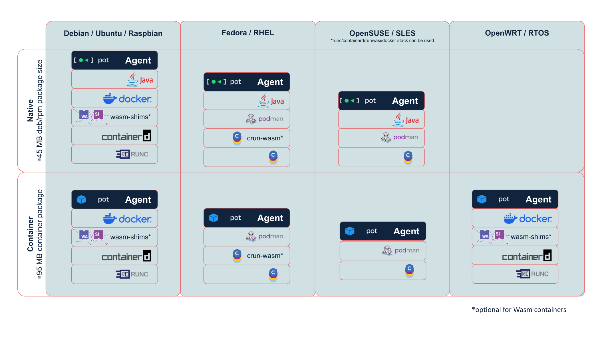

# Agent

**The Edge Node Worker**

The Agent is the worker component of an Edge Compute Network. Each Agent runs on an edge node and manages microservices, volumes, resources, and local operations.

## Overview

The Agent is the daemon service that runs on each edge node in your ECN. It locally handles the starting, stopping, and management of microservices running on that particular node. Microservices are deployed as Docker containers (or WebAssembly containers via Runwasi).

## Key Features

- **Microservice Management**: Deploy, start, stop, and manage microservices as containers
- **Volume Management**: Mount volumes and manage persistent storage
- **Resource Management**: Monitor and manage CPU, memory, and network resources
- **Remote Control**: Managed remotely via the Controller - no SSH required
- **Multi-Architecture Support**: Supports various hardware architectures and platforms
- **Local API**: Provides a local REST API for microservice-to-microservice communication

## Deployment

Agents are typically deployed on edge devices as native daemons. They can run on:
- **Industrial Compute Boards**: ARM and x86-based edge devices
- **IoT Gateways**: Network gateways and edge servers
- **Remote Servers**: Far-edge servers in distributed deployments
- **Any Linux Distribution**: Vendor-agnostic hardware support

  

## Architecture

Each Agent reports directly to a Controller. The Controller must be accessible from the Agent, but Agents don't need to be directly accessible from outside networks. This allows Agents to operate behind firewalls and NAT.

## Management

While the Agent has its own CLI, most management tasks are performed through the Controller using potctl or ECN-Viewer. This allows you to deploy and maintain microservices without needing SSH access to every edge node.

## Documentation

- **Overview**: [Agent Overview](https://docs.datasance.com/reference-agent/overview)
- **Configuration**: [Agent Configuration](https://docs.datasance.com/reference-agent/configuration)
- **CLI Usage**: [Agent CLI Usage](https://docs.datasance.com/reference-agent/cli-usage)
- **Local API**: [Agent Local API](https://docs.datasance.com/reference-agent/local-api)
- **Management**: [Agent Management](https://docs.datasance.com/agent-management/introduction)

## Repository

**GitHub**: [https://github.com/Datasance/Agent](https://github.com/Datasance/Agent)

## Related Components

- [Controller](../controller/) - Orchestrates and manages Agents
- [potctl](../potctl/) - CLI tool for deploying and managing Agents
- [Router](../router/) - Enables microservice communication between Agents

